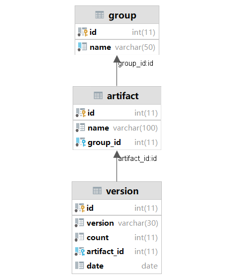

# CS209A Project Report

**Frontend: 宋一鸣 12011609**

**Backend: 王立全 12011619**

**Frontend & Backend: 方嘉玮 12110804**


## Overview

___

In this project, we mainly discuss two major issues:

- Hot dependencies in pom.xml
- Tool used contribution in different countries

The architecture of the project is **Vue + SpringBoot**. The development of frontend and backend are splited, and as a result any of them can work separately. The interaction between the frontend and the backend are achieved through Rest API, and we use **Json** as the data exchange format.

In this report, we will introduce the features related to the evaluation and the structure of this project.

## Features

___


## Project Structure

___

## Frontend

File tree

```
│   .browserslistrc
│   .gitignore
│   babel.config.js
│   jsconfig.json
│   LICENSE
│   package-lock.json
│   package.json
│   postcss.config.js
│   preview.png
│   README.md
│   tailwind.config.js
│   vue.config.js
│   yarn.lock
│
├───public
│       .htaccess
│       favicon.ico
│       index.html
│       web.config
│       _redirects
│
└───src
    │   App.vue
    │   main.js
    │
    ├───assets
    │   │   animate.css
    │   │   logo.png
    │   │   tailwind.css
    │   │
    │   ├───img
    │   │       user.jpg
    │   │       user.png
    │   │       user1.png
    │   │       user2.png
    │   │       user3.png
    │   │       user4.png
    │   │       user5.png
    │   │
    │   └───sass
    │       │   app.windzo.scss
    │       │
    │       └───css
    │               windzo.css
    │               windzo.css.map
    │
    ├───components
    │       AppAccordion.vue
    │       Dropdown.vue
    │       Footer.vue
    │       Header.vue
    │       MenuAccordion.vue
    │       Sidebar.vue
    │
    ├───router
    │       index.js
    │
    └───views
        │   Dashboard.vue
        │
        └───components
                accordion.vue
                alert.vue
                badges.vue
                breadcumbs.vue
                button.vue
                card.vue
```

#### Structure

The whole frontend is based on ```NodeJs``` and ```Vue.js``` framework. The intention is to create a dynamic web application that allows user interaction from **web brosers** for an immersive user experience, and without the need to interact with the server API to change the web content. *In this project we used Windzo as a template* (See [sahrullahh/windzo: Free Open Source Template Dashboard Admin Vue Tailwind CSS (github.com)](https://github.com/sahrullahh/windzo)).

The frontend and the backend uses **Rest API** to communicate: The frontend uses ```get``` method to get the data from the backend server. When necessary, it also uses ```post```  method to post configurations and operations to the backend server for further actions.

```
Navigation
├───DashBoard
├───ComponentTest
│       ├───Accordion
│       ├───Alert
│       ├───Badges
│       ├───Breadcumbs
│       ├───Button
│       ├───Card
│       └───Badges
└───OnlineTest
```


## Backend

File tree

```
├───java
│   └───edu
│       └───sustech
│           ├───backend
│           │   ├───controller
│           │   │   └───API
│           │   ├───dao
│           │   ├───dto
│           │   ├───entities
│           │   └───service
│           │       └───models
│           └───search
│               └───engine
│                   └───github
│                       ├───analyzer
│                       ├───API
│                       │   ├───rate
│                       │   └───search
│                       │       └───requests
│                       ├───models
│                       │   ├───code
│                       │   ├───commit
│                       │   ├───content
│                       │   ├───githubapp
│                       │   ├───issue
│                       │   ├───label
│                       │   ├───pullrequests
│                       │   ├───repository
│                       │   ├───topic
│                       │   └───user
│                       ├───parser
│                       └───transformer
└───resources
    └───dao
```

### Controller

___

#### getTopUsedDependencies

```java
@RequestMapping("data/top-used-dependencies")
public ResponseEntity<String> getTopUsedDependencies(
    @RequestParam(value = "group", required = false) String group,
    @RequestParam(value = "date", required = false) Date date,
    @RequestParam(value = "count", required = false, defaultValue = "10") Integer count) {
    return ResponseEntity.ok(backendService.getTopUsedDependencies(group, date, count));
}
```

This method returns the top used dependencies using specific param: **group、date、count**

The frontend can also set no search param to get the general result


#### getTopUsedVersions

```java
@RequestMapping("data/top-used-version")
public ResponseEntity<String> getTopUsedVersions(
    @RequestParam("group") String group,
    @RequestParam("arifact") String artifact,
    @RequestParam(value = "year", required = false) Integer year) {
    return ResponseEntity.ok(backendService.getTopUsedVersions(group, artifact, year));
}
```

This method returns the top used versions of specific **group**'s **artifact** in a specific **year(not neccessary)** to frontend


#### getGroups

```java
@RequestMapping("groups")
public String getGroups(){
    return backendService.getAvailableGroupSelections();
}
```

This method returns the group list that the user can select


#### update

```java
@RequestMapping("local/update-all")
public ResponseEntity<String> update() throws IOException, InterruptedException {
    if (status == UpdateStatus.NOT_INITIATED) {
        status = UpdateStatus.PROGRESS;
        updateData();
    } else {return ResponseEntity.badRequest().body("Failed. The update is initiated: " + status);}
    return ResponseEntity.ok("OK. Update status: " + status);
}
```

This method updates all the data for frontend by invoking the GitHub Search Engine.


### GitHub Search Engine

___

To make the searching process more fluently, automatically and more robust, we introduce the GitHub Search Engine.

This GitHub Search Engine has iterated *several* times, been published to GitHub and has till now released several packages of different versions. You can check them on [IskXCr/GitHubSearchEngine: A GitHub search engine for backend application](https://github.com/IskXCr/GitHubSearchEngine). To load the GitHub Search Engine from GitHub Packages, you may need to configure your local ``.m2`` maven repository settings (which is typically under the ``Users/{UserName}`` folder, if Windows is considered).

#### File Tree

```
edu.sustech
└───engine
    ├───github
    │   ├───analyzer
    │   │       Analyzer.java
    │   │
    │   ├───API
    │   │   │   ContentAPI.java
    │   │   │   FileAPI.java
    │   │   │   GitHubAPI.java
    │   │   │   RepositoryAPI.java
    │   │   │   RequestRateExceededException.java
    │   │   │   RestAPI.java
    │   │   │   SearchAPI.java
    │   │   │   UserAPI.java
    │   │   │
    │   │   ├───rate
    │   │   │       ActionsRunnerRegistration.java
    │   │   │       CodeScanningUpload.java
    │   │   │       Core.java
    │   │   │       Graphql.java
    │   │   │       IntegrationManifest.java
    │   │   │       Rate.java
    │   │   │       RateLimitResult.java
    │   │   │       Resources.java
    │   │   │       Scim.java
    │   │   │       Search.java
    │   │   │       SourceImport.java
    │   │   │
    │   │   ├───repository
    │   │   ├───search
    │   │   │   │   ETag.java
    │   │   │   │   InvalidResultException.java
    │   │   │   │
    │   │   │   └───requests
    │   │   │           CodeSearchRequest.java
    │   │   │           CommitSearchRequest.java
    │   │   │           IPRSearchRequest.java
    │   │   │           LabelSearchRequest.java
    │   │   │           RepoSearchRequest.java
    │   │   │           SearchRequest.java
    │   │   │           TopicSearchRequest.java
    │   │   │           UserSearchRequest.java
    │   │   │
    │   │   └───user
    │   ├───models
    │   │   │   Alias.java
    │   │   │   APIErrorMessage.java
    │   │   │   AppendableResult.java
    │   │   │   Author.java
    │   │   │   AuthorAssociation.java
    │   │   │   CodeOfConduct.java
    │   │   │   Dependency.java
    │   │   │   Entry.java
    │   │   │   License.java
    │   │   │   Match.java
    │   │   │   Milestone.java
    │   │   │   OAuthToken.java
    │   │   │   Owner.java
    │   │   │   Parent.java
    │   │   │   Permissions.java
    │   │   │   Reactions.java
    │   │   │   Related.java
    │   │   │   State.java
    │   │   │   TextMatch.java
    │   │   │
    │   │   ├───code
    │   │   │       CodeItem.java
    │   │   │       CodeResult.java
    │   │   │
    │   │   ├───commit
    │   │   │       Commit.java
    │   │   │       CommitItem.java
    │   │   │       CommitResult.java
    │   │   │       Tree.java
    │   │   │       Verification.java
    │   │   │
    │   │   ├───content
    │   │   │       ContentDirectory.java
    │   │   │       ContentFile.java
    │   │   │       Links.java
    │   │   │       RawContent.java
    │   │   │       SymlinkContent.java
    │   │   │
    │   │   ├───filetree
    │   │   ├───githubapp
    │   │   │       GitHubApp.java
    │   │   │       Permissions.java
    │   │   │
    │   │   ├───issue
    │   │   │       IPRResult.java
    │   │   │       Issue.java
    │   │   │
    │   │   ├───label
    │   │   │       Label.java
    │   │   │       LabelResult.java
    │   │   │
    │   │   ├───pullrequests
    │   │   │       PullRequest.java
    │   │   │       PullRequestResult.java
    │   │   │
    │   │   ├───repository
    │   │   │       Repository.java
    │   │   │       RepositoryResult.java
    │   │   │
    │   │   ├───topic
    │   │   │       Topic.java
    │   │   │       TopicRelation.java
    │   │   │       TopicResult.java
    │   │   │
    │   │   └───user
    │   │           User.java
    │   │           UserResult.java
    │   │
    │   ├───parser
    │   │       JsonSchemaParser.java
    │   │
    │   ├───test
    │   └───transformer
    │           Transformer.java
    │
    └───stackoverflow
```

#### Functionality & Features

The engine has a ***full implementation (except for acquiring Trees)***  of the search function of the GitHub Rest API (```SearchAPI```) and provides*** Java abstractions*** for dealing with entities present in GitHub (for example, ``Repository``, ``User``, ``Issues``, ``Commits``, etc. Those existing models can be found inside the ```models``` directory in the source code). It also provides additional ***partially implemented*** APIs such as ```UserAPI```, ```RepositoryAPI``` and ```RateAPI``` for other needs such as tracing user locations and attain the information related to real-time GitHub rate limits, get the contributions of an user to a specific repository, etc.

Search requests and along with other operations can be constructed through ***pure Java codes*** and be passed to the ```SearchAPI``` or ```RepositoryAPI```, etc. In the implementation of the ```SearchAPI```, all http responses received and the process of parsing , error/exception processing and loop fetching (fetch until results acquired are more than or equals to the desired number of results, which is a parameter that can be either specified or left to ``Integer.MAX_VALUE``) are ***hidden at default*** from the caller. The user of this engine is able to manipulate the interaction with the GitHub SearchEngine (***without*** even learning the GitHub RestAPI) in a Java way and does not need to care about the inner processing and handling. Advanced manipulations of the engine can also be done with specified request parameters and through the usage of the generic methods pre-implemented.

All APIs are extended from the basic class ``RestAPI``. ```RestAPI``` provides the basic functionality to communicate with the GitHub RestAPI, retrieving data from it, and parse the result into a required object.


#### Major Implementations in the ``SearchAPI``

##### searchLoopFetching method

```java
		public AppendableResult searchLoopFetching(SearchRequest request1, 
                                                   @Nullable AppendableResult origin 
                                                   AppendableResultParser p, 
                                                   int count, 
                                                   long timeIntervalMillis) throws InterruptedException, IOException {...}

```

This method uses ``AppendableResult`` as both one of the parameters and the result. The ``AppendableResultParser`` is an ``@FunctionalInterface``, allowing the parsing and the manipulation of the object with unknown type.

##### searchLoopFetching method (Generic)

This method needs the target class to implement ```AppendableResult``` interface for combining result data from different responses.

```java
/**
     * This method uses while loop to request for search results.
     * Please notice that the GitHub REST API may severely restrict your ability to query the result.
     * <br>
     * If too often the secondary rate limit is encountered, please increase the <code>timeIntervalMillis</code>
     * (a typical recommendation might be <code>18000</code>), and run this method in another thread.
     *
     * @param <T>                Result type
     * @param request1           Request (will create another copy)
     * @param targetClazz        Target class for object mapper
     * @param count              Target Item count. Note that the actual items retrieved might be more
     * @param timeIntervalMillis Preferred time interval between requests
     * @return CodeResult
     * @throws IOException
     * @throws InterruptedException
     */
    @SuppressWarnings("unchecked")
    public <T extends AppendableResult> T searchType(SearchRequest request1, 
                                                     Class<T> targetClazz, 
                                                     int count, 
                                                     long timeIntervalMillis) throws IOException, InterruptedException {
        return (T) searchLoopFetching(request1, 
                                      s -> convert(s, targetClazz), 
                                      count, 
                                      timeIntervalMillis); //It must be T, so no worry.
    }
```

An automatical loop for dealing with the common exceptions, including ```timeout```, ```RateLimitExceeded``` has been constructed to improve the user experience when in autonomous mode.

#### Basic Usage (A demonstration)

##### Build a request

```java
	CodeSearchRequest req1 = CodeSearchRequest.newBuilder()
        .addSearchField(CodeSearchRequest.SearchBy.Filename, "pom.xml")
		.addLanguageOption("Maven POM")
		.build();
```

Similar searches can be done on ```Issues```, ```Pull Requests```, ```Commits```, ```Users```, ```Repositories```, ```RawFiles```

##### Search in GitHub

```java
	//Register the API
	private final GitHubAPI gitHubAPI = GitHubAPI.registerAPI(PersonalAccessToken);
	
	CodeResult result1 = gitHubAPI.searchAPI.searchCode(req1, 
                                                        count, 
                                                       LOCAL_SEARCH_UPDATE_INTERVAL_MILLIS);
```

##### Query the results

```java
	for(CodeItem item: result1){
        
        Repository repo = item.getRepository();
        System.out.println(repo.getFullName() + ", " + item.getName());
        
        //Get the list of contributors
        List<User> userList = gitHubAPI.repositoryAPI.getContributors(repo);
        
        //Sort users by their contributions in the specific repository 
		userList.sort(Comparator.comparingInt(User::getContributions).reversed());
        for(User user: userList){
            System.out.println(user.getLogin());
        }
    }
```

#### Abstractions

**All** items related to the **search** part of the GitHub RestAPI has been implemented. See the file tree above to get more info.

These objects provides a basic but complex abstraction of entities on the GitHub website. At the same time, all the objects are POJOs and can be easily serialized and deserialized.

#### Implementation of the GitHub Search Engine (Partially)

See the source code.

#### Documentations

Documentations will later be generated in the format of JavaDoc directly from those JavaDoc embedded in the code. The code implements the basic methods all as generic, and users are expected to check the documents of those generic methods when encountering specific problems with the implementation of a specifc method (that is related to a certain abstraction, for example ``User``).

### Data Persistence

We use two methods for data persistence:

#### Database

We use cloud **MySQL** database and **Mybatis** ORM framework

.

Here is an dto example

```java
@Data
@AllArgsConstructor
@NoArgsConstructor
@Repository
public class Version {
	Integer id;
	String version;
	Integer count;
	Integer artifactId;
}
```

Here is an dao example, we use **Mybatis**

```java
public interface VersionDao {
	int insert(@Param("version") String version,@Param("artifactId") Integer artifactId);

	Version get(@Param("version") String version,@Param("artifactId") Integer artifactId);

	//count++
	void increment(@Param("id") Integer id,@Param("newCount") Integer newCount);
}
```

```xml
<?xml version="1.0" encoding="UTF-8"?>
<!DOCTYPE mapper PUBLIC "-//mybatis.org//DTD Mapper 3.0//EN" "http://mybatis.org/dtd/mybatis-3-mapper.dtd">
<mapper namespace="edu.sustech.backend.dao.VersionDao">
    <insert id="insert">
        insert into version(version, count, artifact_id) values (#{version},1,#{artifactId})
    </insert>

    <select id="get" resultType="Version">
        select * from version where version=#{version} and artifact_id=#{artifactId}
    </select>

    <update id="increment">
        update version set count=#{newCount} where id=#{id}
    </update>
</mapper>
```

 #### File

Besides the database, we also use files, which stores the json data.


## Insights